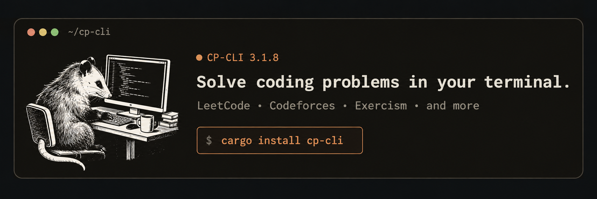

<h1 align="center">cp-cli</h1>

<p align="center">
  <a href="https://crates.io/crates/cp-cli"></a>
  <a href="https://crates.io/crates/cp-cli"></a>
  <a href="LICENSE"></a>
  <a href="https://github.com/keys-i/cp-cli/actions/workflows/checks.yml"></a>
</p>

<p align="center">
  <a href="#installation">Install</a> ·
  <a href="#usage">Usage</a> ·
  <a href="#configuration">Configuration</a> ·
  <a href="docs/CHANGELOG.md">Changelog</a> ·
  <a href="docs/CONTRIBUTING.md">Contributing</a> ·
  <a href="docs/SECURITY.md">Security</a>
</p>

<p align="center">
  
</p>

> [!NOTE]
> cp-cli is not affiliated with or endorsed by LeetCode, HackerRank, Codeforces,
> Exercism, Project Euler, HackerEarth, or CodeChef.

`cp-cli` is a Rust terminal client for coding-problem platforms. It browses problems, creates
starter files, tests and submits LeetCode solutions, and returns JSON for scripts.

## Installation

### macOS and Linux

The installer detects supported macOS and Linux architectures, verifies the checksum, and
installs to `~/.local/bin` by default.

```sh
curl --proto '=https' --proto-redir '=https' --tlsv1.2 -fsSLO https://github.com/keys-i/cp-cli/releases/latest/download/install.sh
sh install.sh
```

Use `--version 3.1.8` for a specific release or `--install-dir <DIRECTORY>` for another
location. The installer reports when the directory must be added to `PATH`.

### Windows

PowerShell detects x64 or arm64 Windows, verifies the checksum, and installs for the current
user. It adds the install directory to the user `PATH` when needed.

```powershell
Invoke-WebRequest https://github.com/keys-i/cp-cli/releases/latest/download/install.ps1 -OutFile "$env:TEMP\cp-cli-install.ps1"
powershell.exe -NoProfile -ExecutionPolicy Bypass -File "$env:TEMP\cp-cli-install.ps1"
```

Add `-Version 3.1.8` or `-InstallDir <DIRECTORY>` after the script path. The process-scoped
execution-policy flag does not change the machine policy.

### Manual archives

[GitHub Releases](https://github.com/keys-i/cp-cli/releases/latest) provides these archives.
Each release includes `SHA256SUMS` for the installers and archives, plus provenance.

| Machine | Release archive |
| --- | --- |
| macOS, Apple silicon | `cp-cli-aarch64-apple-darwin.tar.gz` |
| macOS, Intel | `cp-cli-x86_64-apple-darwin.tar.gz` |
| Linux, x64 | `cp-cli-x86_64-unknown-linux-musl.tar.gz` |
| Linux, arm64 | `cp-cli-aarch64-unknown-linux-musl.tar.gz` |
| Windows, x64 | `cp-cli-x86_64-pc-windows-msvc.zip` |
| Windows, arm64 | `cp-cli-aarch64-pc-windows-msvc.zip` |

### Cargo and source

Install from crates.io:

```sh
cargo install cp-cli --locked
cp-cli --help
```

Build this checkout with Rust 1.88 or newer:

```sh
cargo build --release --locked
./target/release/cp-cli --help
```

## Usage

```sh
cargo run --locked -- problem daily
cargo run --locked -- --platform hackerrank problem list
cargo run --locked -- --platform codeforces stats tourist
cargo run --locked -- --platform codeforces contest list
cargo run --locked -- --platform exercism problem pick two-fer --track rust
cargo run --locked -- --platform project-euler problem list --recent
cargo run --locked -- --platform codechef discussion list
```

`problem show <ID>` accepts a LeetCode number or slug, HackerRank URL slug, Codeforces
contest/index such as `4A`, or a positive Project Euler number. It supports text and JSON.
`--platform leetcode` is optional. `problem daily` opens the public Daily Challenge.

`problem list` pages through public results. LeetCode accepts `--difficulty easy|medium|hard`
and `--tag graph`; HackerRank accepts `--track`; Codeforces and HackerRank accept `--page`.
Project Euler accepts `--recent`; HackerEarth accepts `--topic` paths such as
`algorithms/searching/linear-search`. Other platforms reject LeetCode-only filters.

`problem search <QUERY>` returns 20 results and a total; quote spaces as in
`problem search "binary tree"`. `problem pick <NUMBER|SLUG>` writes `<slug>.<extension>`.
Redirected LeetCode/HackerRank input requires `--lang` and `--dir`; Exercism requires
`--track` and `--dir`. Configure its token at `exercism.org/settings/api_cli`.

`problem test <FILE>` runs a marked LeetCode solution against generated examples.
`problem submit <FILE>` submits it once and polls for up to 60 seconds. `stats` returns
LeetCode counts and ten recent submissions; Codeforces returns 100 recent submissions.

`contest list`, `contest show <SLUG>`, and `contest status` cover schedules and signed-in state.
`discussion list [NUMBER|SLUG]` and `discussion show <ID>` read posts. Use `--help`,
`problem --help`, or a command's `--help`; there is no `help` subcommand.

### Platform support

| Platform | Auth and stats | Problems | Contests | Discussions |
| --- | --- | --- | --- | --- |
| LeetCode | Environment or saved-session validation; account stats | List, show, starter, test, submit | List, show, status; participation and organizer actions unavailable | Read only; writes need a verified mutation API |
| HackerRank | Public profile stats | List, show, starter | Unavailable | Unavailable |
| Codeforces | Signed API credentials; public stats | List and metadata show | List and show | Recent blogs and comments |
| Exercism | Official CLI token configuration | Official `exercism` CLI pick, test, submit | Unavailable | Unavailable |
| Project Euler | Unavailable | Catalogue list, `--recent`, statement show | Unavailable | Unavailable |
| HackerEarth | Unavailable | Practice-topic list and statement show | Unavailable | Unavailable |
| CodeChef | Public profile stats | Unavailable | Unavailable | CodeChef Discuss list and show |

HackerRank, HackerEarth, and Project Euler statements render in the terminal. Project Euler
keeps CC BY-NC-SA attribution. Codeforces has metadata, not statements. CodeChef has no
dependable public problem catalogue. cp-cli does not copy cookies or automate private APIs.

## Configuration

Colour is automatic. Use `--color always` or `--color never`; `NO_COLOR` disables it, and
`TERM=dumb` also disables enlarged titles. JSON is always clean.

Themes are `possum` (default), `arcade`, `phosphor`, `amber`, and `moonlight`. The possum uses
[terminal raster glyphs](https://benmandrew.com/articles/terminal-renderer). Narrow windows use
a text badge; very narrow windows omit it. cp-cli does not alter the terminal profile.

`--background auto` tries a terminal query, then `COLORFGBG`, then assumes dark (light for
`--theme light`). Override with `--background light` or `--background dark`. The 256-colour
palette aims 4.5:1 per [WCAG](https://www.w3.org/WAI/WCAG22/Understanding/contrast-minimum.html).

Connecting uses four bounded 260 ms possum frames. Progress shows received bytes, never a
percentage; `--no-animation` is static. Progress needs two terminals and is disabled for JSON.
`--sound` rings once after successful text output, never for JSON, redirected output, or failures.

Apple Terminal (`TERM_PROGRAM=Apple_Terminal`) and Windows Terminal (`WT_SESSION`) support
double-size titles. `--heading-size auto` enables them at 60 columns; `large` forces them;
`normal` disables them.

At 80 columns, lists and recent submissions use a 60%-width reader. Arrows move rows and
headers; Enter sorts or opens; mouse controls select or sort; `q`, Escape, or Ctrl-C closes.
Other output is static. Statements cap at 100 columns. `problem show` takes a number or slug.

LaTeX in `$…$`, `$$…$$`, `\(…\)`, and `\[…\]` renders as Unicode math without a browser or
TeX. Unsupported, oversized, and malformed input remains source. Images are links only and
are not fetched. The terminal font must include the required Unicode characters.

Problem JSON has `id`, `title`, and HTML `statement`; search adds `query`, `total`, and compact
`results`; list adds filters. Diagnostics use stderr. Invalid arguments exit 2; failures exit 1.

### Authentication

Public browsing and starter retrieval never send cookies. LeetCode has no documented OAuth,
device callback, or terminal-native login. `cp-cli auth login` is unavailable and opens nothing.
`LEETCODE_SESSION` with `LEETCODE_CSRFTOKEN` or `LEETCODE_CSRF_TOKEN` takes precedence over
secure storage. On headless Linux without Secret Service, use those variables. `auth logout`
removes only compatible saved cp-cli credentials, never parent-shell variables.

`cp-cli --platform codeforces auth login` accepts a preissued key and hidden secret, verifies
`user.friends`, and stores one credential. `CODEFORCES_API_KEY` and `CODEFORCES_API_SECRET`
take precedence. Exercism auth runs `exercism configure --token` with a hidden token.

## Development

```sh
cargo test --workspace --all-targets --all-features --locked
cargo clippy --workspace --all-targets --all-features --locked -- -D warnings
cargo fmt --all -- --check
```

Requests have connection, read, and total timeouts. They do not redirect or retry and cap
responses at 2 MiB. Tests use a local HTTP server. `--no-default-features` disables LeetCode.

## Security

Do not open a public issue with session cookies or tokens, credentials, private submission data,
unpatched working exploits, or sensitive logs. Follow [SECURITY.md](docs/SECURITY.md).

## Contributing and license

See [CONTRIBUTING.md](docs/CONTRIBUTING.md). Licensed under the [MIT License](LICENSE).
